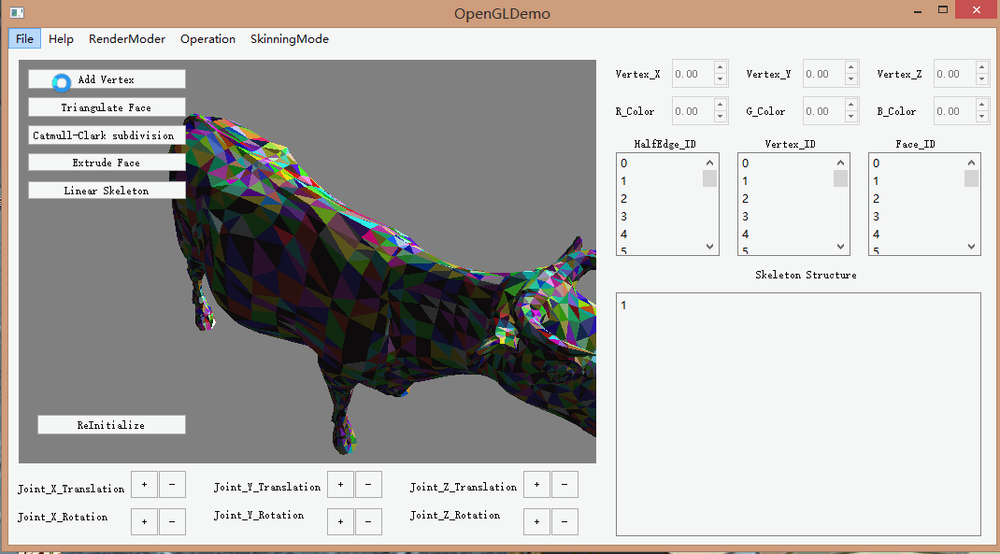

Project of Skinning and Skeleton
======================

**University of Pennsylvania, Computer Graphics**

## Description

This Mesh Editor tool is implemented with C++ and OpenGL on the platform of QT Creator. Main features include:  
* **Scene Graph structure**    
* **Half Edge Mesh data structure**      
* **Catmull Clark Subdivision**       
* **Skinning and Skeletion**

            

